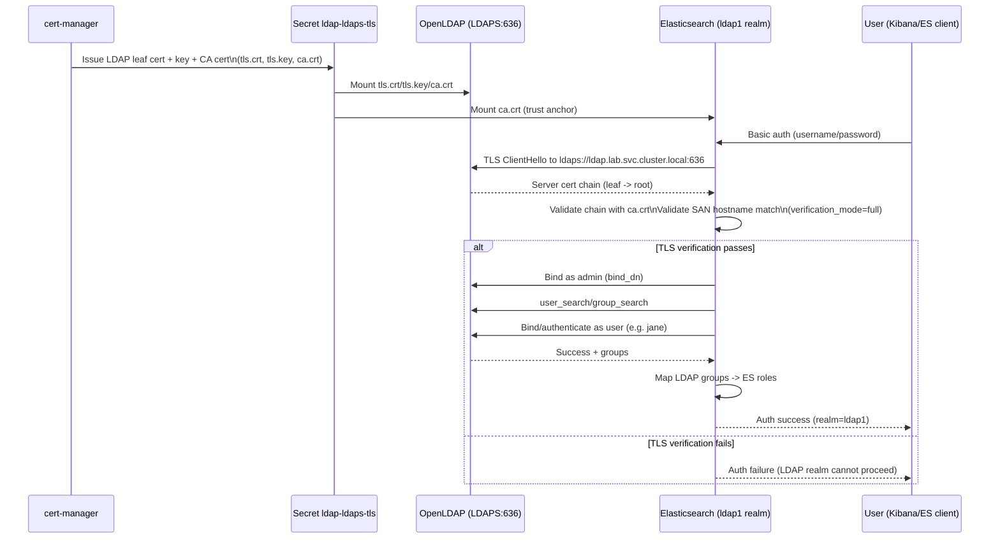

# Local ECK + LDAPS Lab (k3d)

This repository provisions a fully local SSO-style lab with:
- k3d Kubernetes cluster (`lab-sso`) + `ingress-nginx`
- cert-manager self-signed root CA + CA issuer
- ECK operator
- Elasticsearch + Kibana with cert-manager TLS certs
- OpenLDAP over LDAPS + phpLDAPadmin UI
- Elasticsearch LDAP realm over LDAPS with group-based role mapping

## Prerequisites
- Docker
- kubectl
- k3d
- curl
- openssl

## Quick Start
```bash
make up
make test
```

### Version Overrides
Set versions at runtime:
```bash
make up ES_VERSION=8.19.11
make up ES_VERSION=9.2.5
make up ES_VERSION=9.2.5 ECK_VERSION=2.16.1
```

- `ES_VERSION` controls both Elasticsearch and Kibana versions.
- `ECK_VERSION` controls the operator/crds download version in `scripts/install_eck.sh`.
- `make up` now runs `scripts/validate_version.sh` first to verify the requested image tag exists for both:
  - `docker.elastic.co/elasticsearch/elasticsearch:<ES_VERSION>`
  - `docker.elastic.co/kibana/kibana:<ES_VERSION>`

## Endpoints
- Kibana: `https://kibana.<HOST_IP>.sslip.io`
- Elasticsearch: `https://es.<HOST_IP>.sslip.io`
- LDAP UI: `https://ldap-ui.<HOST_IP>.sslip.io`

`HOST_IP` is auto-detected by `scripts/detect_host_ip.sh`.

## Test Users / Credentials
- LDAP admin DN: `cn=admin,dc=example,dc=org`
- LDAP admin password: `Admin123!`
- LDAP test user: `jane`
- LDAP test user password: `Password123!`
- Elastic superuser password:
```bash
kubectl -n lab get secret elasticsearch-es-elastic-user -o jsonpath='{.data.elastic}' | base64 -d; echo
```

## How LDAP Auth Works
1. User logs in to Kibana or calls Elasticsearch with basic auth.
2. Elasticsearch LDAP realm `ldap1` binds to LDAP using admin bind DN.
3. Elasticsearch searches user in `ou=people,dc=example,dc=org` via `(uid={0})`.
4. Elasticsearch authenticates user over LDAPS (`ldaps://ldap.lab.svc.cluster.local:636`).
5. Elasticsearch resolves group membership from `ou=groups,dc=example,dc=org`.
6. Role mapping maps LDAP group `cn=es-users,ou=groups,dc=example,dc=org` to `kibana_admin` and `superuser`.

## LDAP Configuration In Manifests

### Elasticsearch LDAP Realm (`manifests/elastic/elasticsearch.yaml`)
```yaml
xpack.security.authc.realms.ldap.ldap1.url: "ldaps://ldap.lab.svc.cluster.local:636"
xpack.security.authc.realms.ldap.ldap1.bind_dn: "cn=admin,dc=example,dc=org"
xpack.security.authc.realms.ldap.ldap1.user_search.base_dn: "ou=people,dc=example,dc=org"
xpack.security.authc.realms.ldap.ldap1.user_search.filter: "(uid={0})"
xpack.security.authc.realms.ldap.ldap1.group_search.base_dn: "ou=groups,dc=example,dc=org"
xpack.security.authc.realms.ldap.ldap1.ssl.certificate_authorities:
  - "/usr/share/elasticsearch/config/ldap-certs/ca.crt"
xpack.security.authc.realms.ldap.ldap1.ssl.verification_mode: full
```

### LDAP Bind Password Secret (`manifests/elastic/elastic-ldap-realm-config.yaml`)
```yaml
stringData:
  xpack.security.authc.realms.ldap.ldap1.secure_bind_password: Admin123!
```

### Role Mapping (`manifests/elastic/role-mapping.yaml`)
```yaml
kibana_admin:
  - "cn=es-users,ou=groups,dc=example,dc=org"
superuser:
  - "cn=es-users,ou=groups,dc=example,dc=org"
```

## Manifest Map (With Line Numbers)
- LDAP realm core settings:
  - `manifests/elastic/elasticsearch.yaml:20`
  - `manifests/elastic/elasticsearch.yaml:21`
  - `manifests/elastic/elasticsearch.yaml:22`
  - `manifests/elastic/elasticsearch.yaml:23`
  - `manifests/elastic/elasticsearch.yaml:25`
  - `manifests/elastic/elasticsearch.yaml:27`
  - `manifests/elastic/elasticsearch.yaml:28`
- LDAP bind password secure setting:
  - `manifests/elastic/elastic-ldap-realm-config.yaml:8`
  - `manifests/elastic/elasticsearch.yaml:8`
- LDAP CA trust mount into Elasticsearch:
  - `manifests/elastic/elasticsearch.yaml:47`
  - `manifests/elastic/elasticsearch.yaml:49`
  - `manifests/elastic/elasticsearch.yaml:51`
  - `manifests/elastic/elasticsearch.yaml:40`
  - `manifests/elastic/elasticsearch.yaml:41`
- LDAP group to ES role mapping:
  - `manifests/elastic/role-mapping.yaml:9`
  - `manifests/elastic/role-mapping.yaml:11`
  - `manifests/elastic/elasticsearch.yaml:26`
- ES/Kibana HTTP TLS cert attachment:
  - `manifests/elastic/elasticsearch.yaml:10`
  - `manifests/elastic/elasticsearch.yaml:13`
  - `manifests/elastic/kibana.yaml:11`
  - `manifests/elastic/kibana.yaml:14`
- Cert-manager certificate definitions:
  - `manifests/cert-manager/cert-es-kibana.yaml:7`
  - `manifests/cert-manager/cert-es-kibana.yaml:11`
  - `manifests/cert-manager/cert-ldap.yaml:7`
  - `manifests/cert-manager/cert-ldap.yaml:15`
- LDAP server TLS usage:
  - `manifests/ldap/ldap-deployment.yaml:36`
  - `manifests/ldap/ldap-deployment.yaml:38`
  - `manifests/ldap/ldap-deployment.yaml:42`
  - `manifests/ldap/ldap-deployment.yaml:47`
  - `manifests/ldap/ldap-deployment.yaml:56`
- Ingress TLS and HTTPS upstream routing:
  - `manifests/ingress/ingress-es.yaml:7`
  - `manifests/ingress/ingress-es.yaml:13`
  - `manifests/ingress/ingress-kibana.yaml:7`
  - `manifests/ingress/ingress-kibana.yaml:13`

## Cert Trust Table
| Component | Cert Secret | Where Applied | Trust/Consumption |
|---|---|---|---|
| Elasticsearch HTTP endpoint | `es-kibana-tls` | `manifests/elastic/elasticsearch.yaml` -> `spec.http.tls.certificate.secretName` | Ingress presents TLS for `es.<HOST_IP>.sslip.io` |
| Kibana HTTP endpoint | `es-kibana-tls` | `manifests/elastic/kibana.yaml` -> `spec.http.tls.certificate.secretName` | Ingress presents TLS for `kibana.<HOST_IP>.sslip.io` |
| LDAP LDAPS server cert | `ldap-ldaps-tls` | Mounted in `manifests/ldap/ldap-deployment.yaml` | OpenLDAP serves LDAPS on `:636` |
| LDAP CA trust in Elasticsearch | `ldap-ldaps-tls` (`ca.crt`) | `manifests/elastic/elasticsearch.yaml` volume mount to `/usr/share/elasticsearch/config/ldap-certs/ca.crt` | LDAP realm validates LDAP server cert (`verification_mode: full`) |

## LDAP Certificate Types (What Is Generated)

This lab uses a 2-level PKI model (no intermediate CA layer):
- Root CA certificate:
  - Generated by cert-manager (`lab-root-ca`, secret `cert-manager/lab-root-ca-secret`).
  - Type: self-signed CA cert (`isCA: true`).
- Leaf/server certificate for LDAP:
  - Generated by cert-manager (`ldap-ldaps-cert`, secret `lab/ldap-ldaps-tls`).
  - Type: end-entity server cert for LDAPS endpoint (`ldap.lab.svc.cluster.local`, plus sslip/internal SANs).
  - Contains:
    - `tls.crt`: LDAP server cert (and may include chain content depending on issuer behavior).
    - `tls.key`: private key for LDAP server cert.
    - `ca.crt`: issuing CA cert used by clients for trust (in this lab, effectively the root CA).

Meaning of cert types:
- Root CA cert:
  - Trust anchor. Clients trust this CA, not the server cert directly.
- Leaf/server cert:
  - Identity cert presented by LDAP server in TLS handshake.
  - Must contain SAN that matches the exact host Elasticsearch uses: `ldap.lab.svc.cluster.local`.
- Full chain:
  - Ordered cert chain from leaf up to issuer/root.
  - In this lab there is no intermediate CA, so chain is effectively leaf -> root.
  - Elasticsearch trusts via `ca.crt` (CA trust anchor) and validates server cert + SAN.

## How Elasticsearch Uses LDAP Certs
- Elasticsearch LDAP realm is configured with:
  - `xpack.security.authc.realms.ldap.ldap1.ssl.certificate_authorities: ["/usr/share/elasticsearch/config/ldap-certs/ca.crt"]`
  - `xpack.security.authc.realms.ldap.ldap1.ssl.verification_mode: full`
- `ca.crt` comes from secret `ldap-ldaps-tls` and is mounted into Elasticsearch pods.
- During LDAPS connection to `ldaps://ldap.lab.svc.cluster.local:636`, Elasticsearch:
  - Verifies chain against mounted CA.
  - Verifies SAN/hostname matches `ldap.lab.svc.cluster.local`.
  - Only then performs LDAP bind/search/auth operations.

## TLS + LDAP Auth Flow (Architecture / Sequence)
```text
                         cert-manager
                              |
                              | issues
                              v
                 +-----------------------------+
                 | Secret: lab/ldap-ldaps-tls |
                 | tls.crt, tls.key, ca.crt   |
                 +-----------------------------+
                     |                    |
       mount tls.crt/tls.key              | mount ca.crt
                     v                    v
             +---------------+      +------------------+
             | OpenLDAP Pod  |      | Elasticsearch Pod|
             | LDAPS :636    |      | LDAP realm ldap1 |
             +---------------+      +------------------+
                    ^                        |
                    | TLS handshake          | LDAPS connect:
                    | (server cert)          | ldap.lab.svc.cluster.local:636
                    |                        |
                    +------------------------+
                             cert verify:
                     chain + SAN(hostname) check

User login flow:
1) User -> Kibana/Elasticsearch with username/password
2) Elasticsearch realm ldap1 binds to LDAP as admin (bind_dn)
3) LDAP user_search/group_search over LDAPS
4) LDAP verifies user password (bind as user)
5) Elasticsearch maps LDAP group -> roles
6) Authenticated response returned (realm=ldap1)
```

### Mermaid Sequence Diagram


## Certificate SANs
Configured in:
- `manifests/cert-manager/cert-es-kibana.yaml`
- `manifests/cert-manager/cert-ldap.yaml`

Live SAN proof example:
```text
X509v3 Subject Alternative Name:
    DNS:ldap.10.0.10.11.sslip.io, DNS:ldap-ui.10.0.10.11.sslip.io, DNS:ldap.lab.svc, DNS:ldap.lab.svc.cluster.local
```

## Sample Logs: LDAP TLS + Auth

### LDAP server logs (TLS established + bind/search)
```text
conn=1001 fd=12 ACCEPT from IP=10.42.0.18:40268 (IP=0.0.0.0:636)
conn=1001 fd=12 TLS established tls_ssf=256 ssf=256
conn=1001 op=0 BIND dn="cn=admin,dc=example,dc=org" mech=SIMPLE ssf=0
conn=1001 op=1 SEARCH RESULT tag=101 err=0 nentries=1 text=
conn=1002 op=2 BIND dn="uid=jane,ou=people,dc=example,dc=org" mech=SIMPLE ssf=0
```

### Elasticsearch auth response (LDAP realm used)
```json
{
  "username": "jane",
  "roles": ["kibana_admin", "superuser"],
  "metadata": {
    "ldap_dn": "uid=jane,ou=people,dc=example,dc=org",
    "ldap_groups": ["cn=es-users,ou=groups,dc=example,dc=org"]
  },
  "authentication_realm": {"name": "ldap1", "type": "ldap"},
  "authentication_type": "realm"
}
```

## Validation Commands

### End-to-end
```bash
make test
```

## Validated Version Matrix
- `ES_VERSION=8.19.11`: `make up` passed, `make test` passed.
- `ES_VERSION=9.2.5`: `make up` passed, `make test` passed.

Note:
- `8.19.12` appears in Elastic artifacts API but is not currently available as Docker image tags on `docker.elastic.co` for both ES and Kibana. The preflight check catches this case early.

### Direct LDAP user auth to Elasticsearch
```bash
HOST_IP=$(./scripts/detect_host_ip.sh)
curl -k -u jane:Password123! "https://es.${HOST_IP}.sslip.io/_security/_authenticate"
```

### Check cert readiness
```bash
kubectl get certificate -A
```

### Check ingresses
```bash
kubectl get ingress -A
```

## Make Targets
- `make up`
- `make down`
- `make status`
- `make logs`
- `make test`

Note: `scripts/deploy_elastic.sh` starts Elasticsearch trial license automatically so LDAP realms are enabled.

## Troubleshooting

Ingress not routing:
- `kubectl -n ingress-nginx get pods`
- `kubectl get ingress -A`

cert-manager cert not Ready:
- `kubectl describe certificate -n lab es-kibana-cert`
- `kubectl describe certificate -n lab ldap-ldaps-cert`
- `kubectl -n cert-manager logs deploy/cert-manager`

LDAP TLS handshake issues:
- Ensure realm URL host exactly matches SAN: `ldap.lab.svc.cluster.local`
- Ensure ES trusts `/usr/share/elasticsearch/config/ldap-certs/ca.crt`
- Re-run SAN check with `openssl s_client`

LDAP realm skipped in ES logs:
- Check license:
```bash
HOST_IP=$(./scripts/detect_host_ip.sh)
ELASTIC_PASSWORD=$(kubectl -n lab get secret elasticsearch-es-elastic-user -o jsonpath='{.data.elastic}' | base64 -d)
curl -k -u "elastic:${ELASTIC_PASSWORD}" "https://es.${HOST_IP}.sslip.io/_license"
```

## Cleanup
```bash
make down
```
